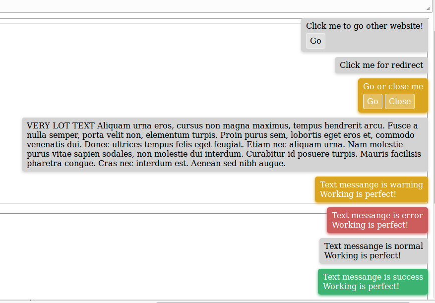

jQuery.miniNoty
============

Super simple / small notifier to use, it's easier just alert ().
[Example](http://jsfiddle.net/StepanMas/sjnh69e6/8/).

	$.miniNoty('My message', 'success');

	// or full settings

	$.miniNoty({
		'class': 'miniNoty',
		timeoutToHide: 3000,  // timeout to hide
		timeoutAnimEnd: 500, // timeout animate in SCSS
		view: 'normal',
		autoHide: true,
		message: 'My message',
		buttons: [
			{
				name: 'Jump to',
				link: 'http://ya.ru',
				target: '_blank'
			}
		],
    	allowButtonClose: false,
    	redirect: false, // click on message to produce redirect, example value: http://mysite,ru
        blank: false // if set prop. redirect that will open in new tab
    })
    
    $.miniNotyConfig.get() // get global config
    $.miniNotyConfig.set({ // set global config
    	timeoutToHide: 6000, // any params
    	timeoutAnimEnd: 1000
    })
    
Screenshot
--------------

Install
--------------

bower install jquery.mininoty   
npm install jquery.mininoty

License
--------------
MIT